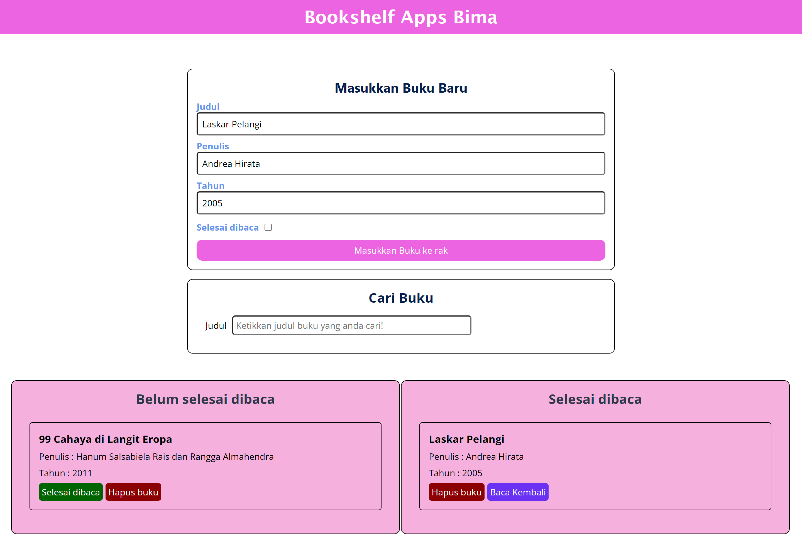

Ini merupakan aplikasi untuk menyimpan catatan buku

<ul>
 <li>Mampu Menambahkan Data Buku baru. </li>
 <li>Memiliki minimal Dua Rak Buku. Yakni “Belum selesai dibaca” dan “Selesai dibaca”. </li>
 <li>Dapat Memindahkan Buku antar Rak.</li>
 <li>Dapat Menghapus Data Buku.</li>
 <li>Manfaatkan localStorage dalam Menyimpan Data Buku</li>
</ul>

berikut tampilannya:

link demo silahkan klik : https://bimahamdani93.github.io/bookShelfApp/
